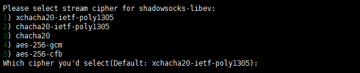
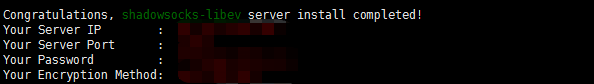
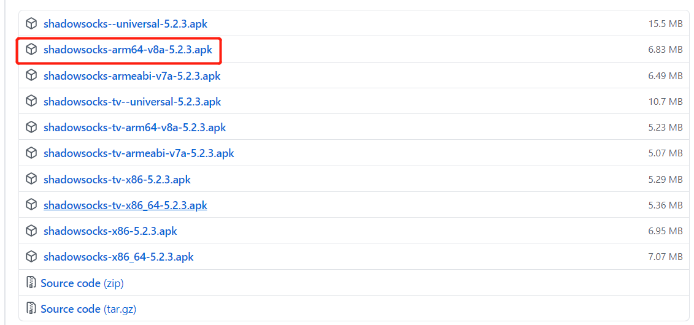
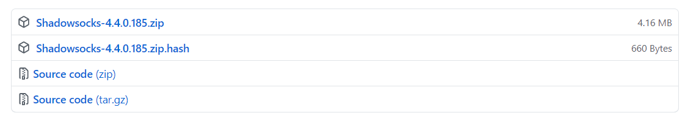

# 科学上网

大约3年前因为需要使用google接触了科学上网，当时非常流行ss代理，在一个网站购买了包月服务开启了外网之旅；后来有机会拥有香港服务器于是自己搭建了ss-server。

本文大致分为三个部分，ss-server搭建、ss-server升级、vpn搭建。

## 1、Shadowsocks

### 1.1 SS介绍（维基百科）

**Shadowsocks**（简称**SS**）是一种基于[Socks5](https://www.tw.wiiaa.top/baike-SOCKS#SOCK5)代理方式的加密传输协议，也可以指实现这个协议的各种开发包。目前包使用[Python](https://www.tw.wiiaa.top/baike-Python)、[C](https://www.tw.wiiaa.top/baike-C語言)、[C++](https://www.tw.wiiaa.top/baike-C%2B%2B)、[C#](https://www.tw.wiiaa.top/baike-C♯)、[Go语言](https://www.tw.wiiaa.top/baike-Go语言)、[Rust](https://www.tw.wiiaa.top/baike-Rust)等编程语言开发，大部分主要实现（[iOS](https://www.tw.wiiaa.top/baike-IOS)平台的除外）采用[Apache许可证](https://www.tw.wiiaa.top/baike-Apache许可证)、[GPL](https://www.tw.wiiaa.top/baike-GPL)、[MIT许可证](https://www.tw.wiiaa.top/baike-MIT許可證)等多种[自由软件](https://www.tw.wiiaa.top/baike-自由軟體)许可协议[开放源代码](https://www.tw.wiiaa.top/baike-開放原始碼)。Shadowsocks分为服务器端和客户端，在使用之前，需要先将服务器端程序部署到服务器上面，然后通过客户端连接并创建本地代理。

在中国大陆，本工具广泛用于突破[防火长城](https://www.tw.wiiaa.top/baike-防火长城)（GFW），以浏览被封锁、遮蔽或干扰的内容。2015年8月22日，Shadowsocks原作者Clowwindy称受到了[中华人民共和国政府的压力](https://www.tw.wiiaa.top/baike-中华人民共和国网络审查)，宣布停止维护此计划（项目）并移除其个人页面所存储的源代码[[4\]](https://www.tw.wiiaa.top/wiki/Shadowsocks#cite_note-4)[[5\]](https://www.tw.wiiaa.top/wiki/Shadowsocks#cite_note-effchinacoder-5)。

为了避免[关键词过滤](https://www.tw.wiiaa.top/baike-关键词过滤)，网民会根据[谐音](https://www.tw.wiiaa.top/baike-諧音_(語言學))将ShadowsocksR称为“酸酸乳”[[注 1\]](https://www.tw.wiiaa.top/wiki/Shadowsocks#cite_note-6)（SSR），将Shadowsocks称为“酸酸”（SS）。另外Shadowsocks的标志为纸飞机，而专门提供Shadowsocks或类似软件（如V2Ray）服务器的网站也被称为“机场”。

### 1.2 SS搭建

#### 1.2.1 快速搭建

目前这个项目在github上仍然能够搜到[点击前往](https://github.com/shadowsocks)，不够原作者已经没有维护了，基于Python的版本也停留在了2017年，但是由于Python安装简单所以也是一个不错的选择，大致流程如下：

```shell
yum install python3-pip
pip3 install --upgrade pip pip3 install setuptools
pip3 install shadowsocks
yum install python-m2crypto
```

安装完毕后新建一个配置文件启动即可：

```shell
vim /etc/shadowsocks.json
{"server":"0.0.0.0",
"server_port":1234, #监听端口
"password":"xxx", #密码
"timeout":300,
"method":"aes-256-cfb", #加密协议
"fast_open":true #是否启用fast_open建议开启
}
systemctl start shadowsocks
```

::: tip 提示

如果有防火墙放行对应的端口即可。

:::

#### 1.2.2  shadowsocks-libev

我个人使用的是这个版本，最新**v3.3.5**上次更新2020年9月，算是比较新的，而且网上也能下载到一键搭建脚本，使用比较方便。

第一次搭建使用的脚本为[shadowsocks-libev.sh](/ss/shadowsocks-libev-old.sh),安装脚本提示一步一步进行就可以了，可以说是非常简单，在使用大约两年后想起升级，于是再次运行这个脚本，虽然ss-server版本升级了，但是客服端却无法连接了；在细心阅读脚本文件后任然找不到原因。

于是乎去网上找了另外一个安装脚本[centos-shadowsocks-libev.sh](/ss/centos-shadowsocks-libev.sh)

在执行前需要卸载原版本，方法很简单`./shadowsocks-libev.sh uninstall`提示是否卸载，输入y即可。

给新脚本添加执行权限，然后直接运行，详细操作如下：

1、提示设置SS密码，输入自定义密码后按回车，也可以直接按回车使用默认密码


2、接下来选择SS要使用的服务器端口，输入自己喜欢的端口， 也可以直接按回车使用默认端口


3、 然后选择加密方式（仅保留相对安全的加密方式），如果选择chacha20的话，就输入对应序号3，按回车继续



4、 安装完成后，会有如下图安装成功的提示，记住各项信息，在客户端连接时需要用到



至此SS服务端就安装完毕了，非常简单，脚本自动拉取最新版本，所有这次成功升级到了最新。

::: tip 提示

安装完后配置文件在`/etc/shadowsocks-libev/config.json`,可自行修改配置。

修改完成后`systemctl restart shadowsocks-libev.service`即可生效。

:::

目前有Go语言的版本，有兴趣朋友可以自行研究。

### 1.3 SS客服端

服务端搭建完毕后需要客户端配合使用，可以到[shadowsocks (github.com)](https://github.com/shadowsocks)找到对应的操作系统版本下载，不过为了方便我给出常用下载地址：

安卓：[Releases · shadowsocks/shadowsocks-android (github.com)](https://github.com/shadowsocks/shadowsocks-android/releases)



一般安卓手机选择arm64即可。

Windows：[Releases · shadowsocks/shadowsocks-windows (github.com)](https://github.com/shadowsocks/shadowsocks-windows/releases)



选择第一个压缩包，解压后直接运行即可。

macOS：[Releases · shadowsocks/ShadowsocksX-NG (github.com)](https://github.com/shadowsocks/ShadowsocksX-NG/releases)

本人无mac，配置方式都差不多。

下载安装后，填上服务器地址、端口号、密码、加密方式就能正常使用了，这里就不再赘述了。

### 1.4 SS服务端优化

目前SS可以使用算法加速，我现在使用的是`BBR`加速和`open_fast`,当然还有`kcptun`由于我目前使用已经很流畅了，就没有继续折腾了。

开启`open_fast`很简单，第一章就提到了，可以自行返回查看。

Google 开源了其 TCP BBR 拥塞控制算法，并提交到了 Linux 内核，从 4.9 开始，Linux 内核已经用上该算法，所有你的机器内核得大于4.9。

如果不幸你低于这个版本，可以参考[Centos7 升级内核版本](https://github.flysch.cn/study/centos7.html)升级。
开启后，可以用这个命令查看 BBR 状态： 

`sysctl net.ipv4.tcp_available_congestion_control` 

如果返回的结果里有 bbr 则说明你的 VPS 已经开启 BBR 加速： 

`net.ipv4.tcp_available_congestion_control = reno cubic bbr`

这里我提供一键配置bbr脚本[点击下载](/ss/bbr.sh)，按照提示运行即可。

## 2、VPN

### 2.1 介绍

###### PPTP

PPTP(Point-to-Point Tunneling Protocol，点对点隧道协议)是由微软为了在拨号网络方面创建VPN而成立的一个团队开发而生，因此长期以来一直都是其企业内部的VPN标准协议。它也是一个通过搭配各种认证方法（通常是MS-CHAP v2）以提供安全性的VPN协议。因为PPTP协议作为一个在几乎所有有VPN能力的平台和设备上都可以无需安装额外软件而使用的标准，它至今仍然是企业和VPN供应商们的热门选择。同时，它有着低计算开销即可实现的优势（通俗地说就是运行速度很快）。

- 几乎所有平台都内置好了PPTP协议的VPN客户端
- 非常易于搭建
- 不够安全（弱势的MSCHAPv2依旧被广泛使用）
- 绝对妥协于NSA

###### L2TP 以及 L2TP/IPsec

L2TP(Layer 2 Tunnel Protocol，第二层隧道协议)是一种协议本身不对通过的流量进行加密或实施保密措施的VPN协议。也正是因为这个原因，L2TP通常会结合IPsec加密套件（如下所述，类似于一种密码）来实现，以此提供安全性和隐私性。

L2TP/IPsec已经被内置于所有现代化操作系统以及具有VPN功能的设置，同时它也如PPTP一般，操作简单、可快速搭建（实际上它与PPTP使用的设备通常也是相同的）。

L2tp/IPsec会进行两次数据封装，这似乎会让速度慢下来。不过首先，它的加密解密行为发生在内核之中，其次LwTP/IPsec也允许多线程（OpenVPN并没有这个功能），这两点完全可以将两次数据封装造成的减速抵消掉，结果是L2TP在理论上会比OpenVPN更快。

- 通常公认其安全
- 易于搭建
- 适用于全部现代化平台
- 较OpenVPN更快
- 或许已经向NSA妥协了（但未被证实）
- 或许被NSA故意削弱过（但未被证实）
- 会跟限制性防火墙产生冲突

###### OpenVPN

OpenVPN可以说是一种崭新的开源技术，它使用了OpenSSL库和SSLv3/TLSv1协议，通过与其他的技术融为一体，来提供一个强大而可靠的VPN解决方案。

- 高度可配置性
- 非常安全（如果使用了PFS完全正向加密，甚至对NSA都是安全的）
- 可以绕过防火墙
- 可以使用多种加密算法
- 开源（因此可以很容易地去检查项目中的后门情况或者其他有可能被NSA修改过的地方）
- 需要第三方软件
- 安装过程比较繁琐
- 尽管在努力改善对移动端设备的支持，缺还是不及桌面端的完善程度

###### SSTP

SSTP（Secure Socket Tunneling Protocol，安全套接字隧道协议）是微软在Windows Vista SP1时推出的，虽然它现在可用于Linux、RouterOS和SEIL，但是它极大程度上还是一种仅限Windows平台的协议（让它支持苹果设备的可能性等同于地狱里面出现了一个雪球）。

- 非常安全（这取决于加密方式，不过通常使用AES就非常强大了）
- 完全集成到了Windows操作系统中（Windows Vista SP1, Windows 7, Windows 8）
- 微软官方支持
- 可以绕过大多数防火墙
- 只有在Windows环境才能真正工作
- 作为微软的专有标准，不能被独立核查出后门以及其他问题

###### IKEv2

IKEv2（Internet Key Exchange version 2，因特网密钥交换版本2）基于IPSec隧道协议，由微软和思科联合开发，并被兼并到了Windows7及以上版本中。

IKEv2有着非常实用的自动重连特性，当用户暂时失去互联网连接（比如进出火车隧道）的时候，它会自动重新建立VPN连接。对于手机用户来说确实是喜大普奔。Ikev2能跑在几乎所有iOS定制的VPN应用上，为了那些使用苹果公司官方VPN API的人无需越狱来使用它（也正因为这些优势，能让VPN供应商能够很容易地把更新配置文件推送到使用VPN的用户或者应用程序上）。

- 比PPTP，SSTP和L2TP更快，它不涉及在点对点协议（Point-to-Point protocols，PPP）上的开销
- 非常稳定 - 尤其是切换网络或者在短暂的网络连接丢失之后重新连接的时候
- 非常安全 - 支持AES 128，AES 192，AES 256以及3DES加密算法
- 易于安装和配置 - 至少在用户端是如此
- 协议也支持黑莓的设备
- 暂时还不支持很多的平台
- 在服务器上搭建IKEv2相对来说很费劲，这也是很多问题的隐患所在 我们所对它的信任仅因为它进行了开源

### 2.2 协议选择

PPTP是搭建最为简单，但也是最不推荐的一种，我个人比较钟爱L2TP/IPsec，这个协议目前几乎所有智能设备都内置了，不用下载客户端即可使用。

有人肯定想问已经在SS稳定使用的情况下为什么还要搭建VPN，之所以会有这个需求，主要是因为SS在小米(MIUI)上有问题，主要体现在不稳定。

开始我以为是软件问题，不过后面把路由器刷了潘多拉后由路由器SS代理仍然不稳定，而且仅我手里这台小米这样，我上一部iphone和我电脑都不存在这个问题。

问题主要体现在打开代理无论pac模式还是全局模式，有概率无法代理APP流量，经常导致steam，google play等软件很长时间无法正常使用（非常抓狂）。

想知道路由器刷固件的可以参考我另外一个[文章](https://github.flysch.cn/life/RM2100.html)

### 2.3 VPN搭建

#### 2.3.1 L2TP

在开始我就要很不幸的告诉大家，我失败了，浪费了一天的时间，试了好几个文章的方法都无法正常连接，我选择放弃了。

下面我给出我找到的文章，感兴趣的可以自行尝试。

[CentOS7 搭建L2TP - 玉米花豆 - 博客园 (cnblogs.com)](https://www.cnblogs.com/fisherpau/p/11576552.html)

[Centos7搭建L2TP与Win10连接测试_CodeSunShines-CSDN博客](https://blog.csdn.net/weixin_44621066/article/details/108285573?utm_medium=distribute.pc_relevant.none-task-blog-2~default~BlogCommendFromMachineLearnPai2~default-4.vipsorttest&depth_1-utm_source=distribute.pc_relevant.none-task-blog-2~default~BlogCommendFromMachineLearnPai2~default-4.vipsorttest)

[腾讯云 CentOS 7.6 部署 pptp vpn - 飘在云端 (0z.gs)](https://www.0z.gs/soso/centos-pptp.html)

::: danger

所有文章我都一步一步试的，配置文件都没问题，服务正常启动，端口都正常开放，但是无论手机还是电脑死活都连不上。

:::

#### 2.3.2 IKEv2

其实这个协议应该算是目前最好的，开始以为搭建会很麻烦，结果比昨天的L2TP还简单，一次成功。

下面是详细操作步骤：

1.安装strongswan

`yum install strongswan`

2.创建证书

`strongswan pki --gen --outform pem > ca.key.pem`

`strongswan pki --self --in ca.key.pem --dn "C=CN, O=one, CN=one t CA" --ca --lifetime 3650 --outform pem > ca.cert.pem`

`strongswan pki --gen --outform pem > server.key.pem`

`strongswan pki --pub --in server.key.pem --outform pem > server.pub.pem`

`strongswan pki --pub --in server.key.pem | strongswan pki --issue --lifetime 3601 --cacert ca.cert.pem --cakey ca.key.pem --dn "C=CN, O=one, CN=one t CA" --san="你的服务器公网ip" --flag serverAuth --flag ikeIntermediate --outform pem > server.cert.pem`

::: tip 提示

注意最后一个代码替换自己服务器ip

:::

3.安装证书

```shell
cp -r ca.key.pem /etc/strongswan/ipsec.d/private/
cp -r ca.cert.pem /etc/strongswan/ipsec.d/cacerts/
cp -r server.cert.pem /etc/strongswan/ipsec.d/certs/
cp -r server.pub.pem /etc/strongswan/ipsec.d/certs/
cp -r server.key.pem /etc/strongswan/ipsec.d/private/
```

4.配置

`vim  /etc/strongswan/ipsec.conf`

```shell
config setup  
    uniqueids=never #允许多个客户端使用同一个证书
 
conn %default  #定义连接项, 命名为 %default 所有连接都会继承它
    compress = yes #是否启用压缩, yes 表示如果支持压缩会启用.
    dpdaction = clear #当意外断开后尝试的操作, hold, 保持并重连直到超时.
    dpddelay = 30s #意外断开后尝试重连时长
    dpdtimeout = 60s #意外断开后超时时长, 只对 IKEv1 起作用
    inactivity = 300s #闲置时长,超过后断开连接.
    leftdns = 8.8.8.8,8.8.4.4 #指定服务端与客户端的dns, 多个用","分隔
    rightdns = 8.8.8.8,8.8.4.4
 
conn IKEv2-BASE
    leftca = "C=CN, O=one, CN=one t CA" #服务器端根证书DN名称，与 --dn 内容一致 
    leftsendcert = always #是否发送服务器证书到客户端
    rightsendcert = never #客户端不发送证书
 
conn IKEv2-EAP  
    keyexchange=ikev2       #默认的密钥交换算法, ike 为自动, 优先使用 IKEv2
    left=%any       #服务器端标识,%any表示任意  
    leftid= 0.0.0.0     #服务器端ID标识，你的服务器公网ip  
    leftsubnet=0.0.0.0/0        #服务器端虚拟ip, 0.0.0.0/0表示通配.  
    leftcert = server.cert.pem     #服务器端证书  
    leftauth=pubkey     #服务器校验方式，使用证书  
    right=%any      #客户端标识，%any表示任意  
    rightsourceip = 20.1.0.0/16    #客户端IP地址分配范围  
    rightauth=eap-mschapv2  #eap-md5#客户端校验方式#KEv2 EAP(Username/Password)   
    also=IKEv2-BASE
    eap_identity = %any #指定客户端eap id
    rekey = no #不自动重置密钥
    fragmentation = yes #开启IKE 消息分片
    auto = add  #当服务启动时, 应该如何处理这个连接项. add 添加到连接表中.
 
#ios 和 mac Psk连接，无需证书 (EAP账号密码及psk)
#android Psk 连接，无需证书（XAUTH账户密码及psk）
conn Android_Ios_Mac_XauthPSK
     keyexchange=ikev1
     ike=aes128-aes256-sha1-modp3072-modp2048,3des-sha1-md5-modp1024,aes256-sha512-modp4096,aes128-sha256-modp3072
     esp=aes128-sha1,aes256-sha256_96,3des-sha1,aes256-sha1
     left=%defaultroute
     leftauth=psk
     leftsubnet=0.0.0.0/0
     right=%any
     rightauth=psk
     rightauth2=xauth
     rightsourceip=20.1.0.0/16
     auto=add
```

5.修改配置

`vim /etc/strongswan/strongswan.conf`

```shell

charon {
        load_modular = yes
        i_dont_care_about_security_and_use_aggressive_mode_psk = yes
        compress = yes
        plugins {
                 duplicheck{
                            enable=no
                 }
                include strongswan.d/charon/*.conf
        }
 
}
include strongswan.d/*.conf
```

5.1查看日志（两种方法）

`1.journalctl -f -u strongswan`

`2.tail -f /var/log/messages`

6.配置用户密码

`vim /etc/strongswan/ipsec.secrets

```shell
#使用证书验证时的服务器端私钥
#格式 : RSA <private key file> [ <passphrase> | %prompt ]
: RSA server.key.pem
 
#使用预设加密密钥, 越长越好
#格式 [ <id selectors> ] : PSK <secret>
: PSK "xxxxx"
 
#EAP 方式, 格式同 psk 相同 (用户名/密码 例：oneAA/oneTT)
oneAA : EAP "oneTT"
 
#XAUTH 方式, 只适用于 IKEv1
#格式 [ <servername> ] <username> : XAUTH "<password>"
oneAA : XAUTH "oneTT"
```

6.开始内核转发

`vim /etc/sysctl.conf`

修改：

`net.ipv4.ip_forward = 1`

如果开启了ipv6，那么也要把对应的改为1

输入下面命令生效：

`sysctl -p`

添加upd端口

```shell
firewall-cmd --permanent --add-port=500-4500/udp
firewall-cmd --permanent --add-masquerade
```

 调整MTU-MSS、添加GRE，否则隧道失败：

```shell
firewall-cmd --permanent --direct --add-rule ipv4 filter INPUT 0 -p gre -j ACCEPT
firewall-cmd --permanent --direct --add-rule ipv4 filter FORWARD 0 -p tcp -i eth0 -j TCPMSS --syn --set-mss 1299
```

8.配置防火墙

`vim /etc/firewalld/zones/public.xml`

```xml

<?xml version="1.0" encoding="utf-8"?>
<zone>
  <short>Public</short>
  <description>For use in public areas. You do not trust the other computers on networks to not harm your computer. Only selected incoming connections are accepted.</description>
  <interface name="eth0"/>
  <service name="ssh"/>
  <service name="dhcpv6-client"/>
  <service name="ipsec"/>
  <port protocol="tcp" port="1723"/>
  <port protocol="tcp" port="47"/>
    <port protocol="tcp" port="1701"/>
    <port protocol="tcp" port="22"/>
    <masquerade/>
    <rule family="ipv4">
     <source address="10.1.0.0/16"/>
      <masquerade/>                                                                                                                                                                                    
    </rule>
    <rule family="ipv4">
      <source address="10.1.0.0/16"/>
      <forward-port to-port="4500" protocol="udp" port="4500"/>
    </rule>
    <rule family="ipv4">
      <source address="10.1.0.0/16"/>
     <forward-port to-port="500" protocol="udp" port="500"/>
   </rule>
  <masquerade/>
</zone>
```

9.开启防火墙和strongswan

`systemctl start firewalld`

`systemctl start strongswan`

10.开放安全组端口

不同云服务商操作方法不同，不过大体相似，参照云服务商文档开启UPD500和4500端口即可。

### 2.4 vpn使用

基本上系统都自带了IKEv2的协议的vpn

将服务器`ca.cert.pem`导出到需要的设备上，ios和mac操作都很简单这里不演示，这里说明一下遇到困难的小米和windows。

小米:

系统自带IKEv2是个废品，无法使用，只能到strongswan官网下载软件使用。

[下载地址](https://download.strongswan.org/Android/?C=M;O=D)

选择最新版本即可。

步骤：右上角选项-->CA证书-->再选择右上角选项-->导入证书-->找到ca.cert.pem点击即可。
         回到主界面-->添加配置-->例：服务器地址：你的服务器公网ip
                                                          类型：IKEv2 EAP(用户名/密码)，填写用户名和密码
                                                           CA证书：选择刚才导入的ca.cert.pem证书
                                                           点击右上角--保存

如果没有问题，这时就能正常连接使用了。

windows:

windows默认不支持DH2048_AES256协商协议,会导致正常导入证书后无法连接。

解决办法：添加注册表项，不需要重启生效

`HKEY_LOCAL_MACHINE\System\CurrentControlSet\Services\Rasman\Parameters里新建类型为DWORD的NegotiateDH2048_AES256 键，值设置为1`

至此windows正常连接。