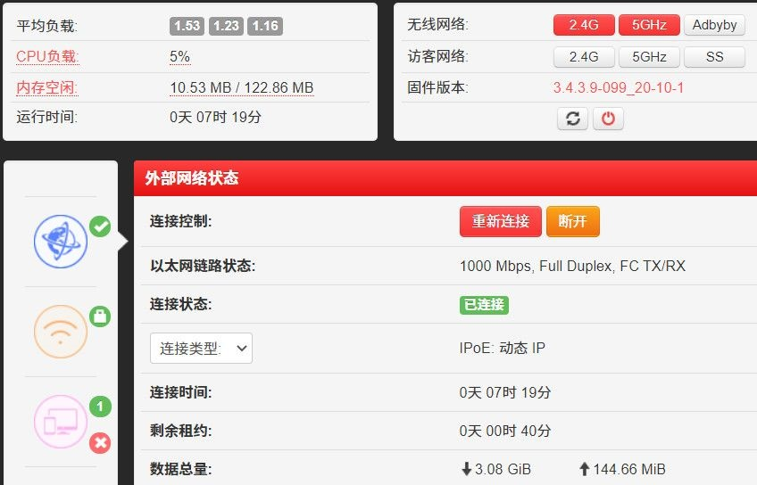

# 红米2100路由器刷机
很久以前买了RM2100，小米官方固件虽然将就用着还行，但是功能太少，前段日子无聊去恩山论坛研究了下怎么刷Padavan，成功后记录一下。

## 1、开启SSH

### 1.1确认版本

利用官方固件漏洞开启SSH，官方**2.0.7***版本存在漏洞，所以第一步确认你手里面的机器目前的版本。

本我有新系统就更新的习惯，所以我手里的路由器是最新版，没关系我们降级就行了。

**官方下载链接：**
红米RM2100： [http://cdn.cnbj1.fds.api.mi-img.com/xiaoqiang/rom/rm2100/miwifi_rm2100_firmware_d6234_2.0.7.bin](http://cdn.cnbj1.fds.api.mi-img.com/xiaoqiang/rom/rm2100/miwifi_rm2100_firmware_d6234_2.0.7.bin) 

小米R2100：[http://cdn.cnbj1.fds.api.mi-img.com/xiaoqiang/rom/r2100/miwifi_r2100_firmware_4b519_2.0.722.bin](http://cdn.cnbj1.fds.api.mi-img.com/xiaoqiang/rom/r2100/miwifi_r2100_firmware_4b519_2.0.722.bin) 

miwifi_rm2100开头的是红米的，miwifi_r2100开头的是小米的。

降级方法非常简单，电脑登录管理页面，在升级固件处选择手工选择，然后确认后等待机器重启即可。

### 1.2漏洞利用

登录管理页面，此时地址栏链接应为：
```
http://192.168.31.1/cgi-bin/luci/;stok=<STOK>/web/home#router
```
**PS:**`<STOK>`是代表你登录后自动生成的那一长串数据，每个人都不一样，用于替换下一步中的链接中部分。

在浏览器地址栏中输入以下链接代码，**注意替换掉**`<STOK>`**部分，否则无效**：

`http://192.168.31.1/cgi-bin/luci/;stok=<STOK>/api/misystem/set_config_iotdev?bssid=Xiaomi&user_id=longdike&ssid=-h%3B%20nvram%20set%20ssh_en%3D1%3B%20nvram%20commit%3B%20sed%20-i%20's%2Fchannel%3D.*%2Fchannel%3D%5C%22debug%5C%22%2Fg'%20%2Fetc%2Finit.d%2Fdropbear%3B%20%2Fetc%2Finit.d%2Fdropbear%20start%3B`


返回{"code":0}即代表成功。

建议**一键注入后需等待一些时间，保证路由器后台能正确处理注入信息后再重启，**重启即可开启SSH。

**接下来更改root密码：**

在浏览器地址栏中输入以下链接代码，**注意替换掉**`<STOK>`**部分，否则无效**：

`http://192.168.31.1/cgi-bin/luci/;stok=<STOK>/api/misystem/set_config_iotdev?bssid=Xiaomi&user_id=longdike&ssid=-h%3B%20echo%20-e%20'admin%5Cnadmin'%20%7C%20passwd%20root%3B`

'admin'表示输入两次密码以修改密码为admin，想要自行设置密码的仅需要改动两个字符admin即可，其他地方不要改，怕出问题或记不住的不用修改。

使用SSH软件登录路由器，我用的Xshell，你们有什么用什么。

## 2、刷入Breed

### 2.1备份

如果后面想刷回官方需要备份一下**BootLoader**，建议都备份一下，代码如下：

```
dd if=/dev/mtd1 of=/tmp/bootloader.bin
```

输入命令后一定要将"/tmp/bootloader.bin"**移动到电脑上**后再操作下一步

对了我传文件用的winscp，你们有什么用什么。

### 2.2刷入breed

**下载breed：**

文件名： breed-mt7621-xiaomi-r3g.bin

H大链接(**建议**) ：[https://breed.hackpascal.net/breed-mt7621-xiaomi-r3g.bin](https://breed.hackpascal.net/breed-mt7621-xiaomi-r3g.bin)

**刷入不死Breed**：

 复制breed-mt7621-xiaomi-r3g.bin 到/tmp

输入命令：

```
mtd -r write /tmp/breed-mt7621-xiaomi-r3g.bin Bootloader
```

等待路由器重启（当电脑获取到ip或者路由只有一个蓝灯亮时，breed引导官方固件成功）。

为防止变砖，强烈**建议等待5分钟后拔电，用牙签按住reset键再插电，等蓝灯闪烁，松开reset键，浏览器访问192.168.1.1**即可进入breedweb界面。

首次进入breed记得先备份下编程器固件和eeprom。

更改环境变量，编缉,新增字段"xiaomi.r3g.bootfw",值设置为 2,然后保存。（否则刷入非原厂固件可能会出现刷入固件后重启指示灯不断蓝黑交替（无限重启）的现象）

至此，路由器成功刷入breed。

## 3、刷入固件

### 3.1下载

Padavan(HIBOY)固件

红米ac2100：[http://opt.cn2qq.com/padavan/RM2100_3.4.3.9-099.trx](http://opt.cn2qq.com/padavan/RM2100_3.4.3.9-099.trx)

小米ac2100：[http://opt.cn2qq.com/padavan/R2100_3.4.3.9-099.trx](http://opt.cn2qq.com/padavan/R2100_3.4.3.9-099.trx)

这个链接下载的一直都是最新版本！

### 3.2刷入固件

点击“固件更新”-在“固件”位置上传trx文件

中复选框"自动重启"-点击上传

确认更新信息-点击"更新"-等待路由器重启

等待路由器LED灯恢复正常后-打开浏览器-进入**http://my.router**

用户名"admin"-密码"admin"

显示下图-正常刷入。



::: tip 提示
对了恩山还说了有些路由器有坏块刷不了，不过我没遇到过，如果你在刷入时遇到问题基本就是这个原因了。

刷机请用网线。
:::