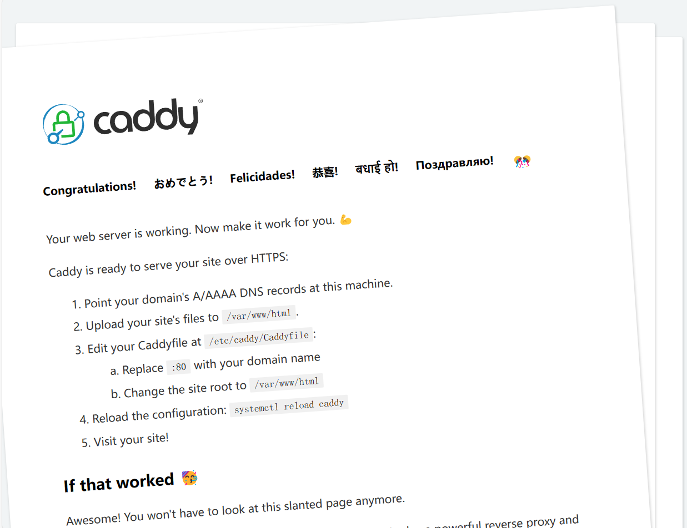
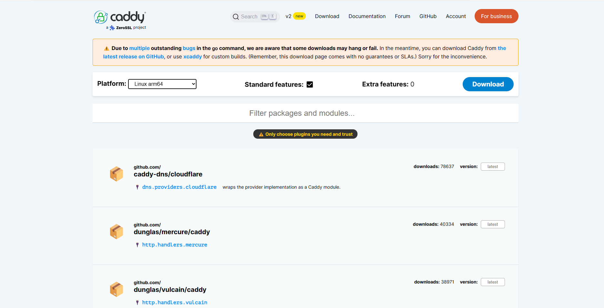
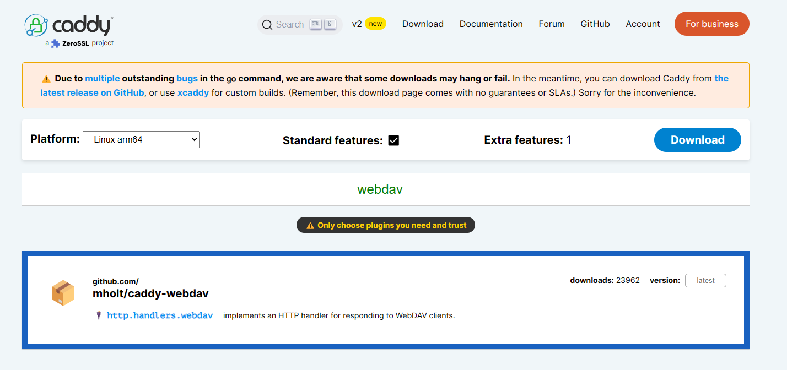
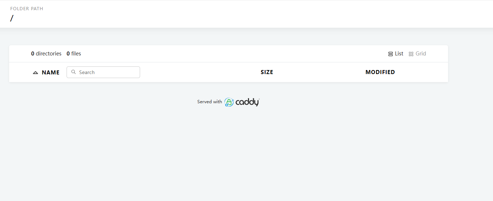

# 使用 *caddy* 自建 *WebDAV* 服务器

[Caddy Web服务器](https://www.wbolt.com/go?_=0e121e780baHR0cHM6Ly9jYWRkeXNlcnZlci5jb20v)是一个开源的、支持HTTP/2的Web服务器，用Go编写，该服务器被设计为简单、高效和便携。Caddy自称是“终极服务器”，旨在让网络托管“尽可能简单”。

## 前言

如果你需要一个WebDAV服务器用于同步你的数据，比如我--密码工具数据同步，当然市面上也有不少网盘类服务也提供这项功能，不过介于密码文件过于重要，所以放在自建的服务上还是让人放心一点。

## 1、准备

一台能够运行docker的机器，不限于NAS、软路由、或者一个刷了Linux的电视盒子，当然你也可以选择把服务直接安装到机器本体上（我不推荐这么做）。

## 2、安装

**拉取docker镜像**：

```shell
#docker pull caddy
Using default tag: latest
latest: Pulling from library/caddy
579b34f0a95b: Pull complete 
2f21cb0286ed: Pull complete 
5444b3f9419d: Pull complete 
3485ef64f848: Pull complete 
Digest: sha256:df239ca80315c8271f9e87a981fb47124831f8b5a7c85970249d2dfd712479a3
Status: Downloaded newer image for caddy:latest
docker.io/library/caddy:latest
```

**创建一个文件夹用于存放配置文件和WebDAV同步数据用**

```shell
#mkdir caddy
#cd caddy/
#mkdir config
#mkdir data
#cd data
#mkdir dav
```

**启动容器：**

```shell
docker run -d -p 9000:80 --name caddy caddy
```



使用浏览器访问ip:9000，如果出现上面图片的内容就说明你成功运行了caddy。

## 2、部署WebDAV

由于标准caddy运行程序并不包涵WebDAV插件，你可以访问caddy官网获取如何使用xcaddy去编译带有WebDAV的caddy。

或者选择和我一样的方式（~~懒，不想继续看文档~~）。

进入[caddy下载界面](https://caddyserver.com/download)：



选择适合你自己的架构，我的机器是arm64的，如果你的机器是x86，请自行更换。

在搜索框输入webdav后选中插件：



这时**Extra features**后面的数字变成1，表示成功，点击Download下载，得到文件**caddy_linux_arm64_custom**

使用sftp工具上传该文件到机器上，并拷贝到 **/caddy/data** 下

停止容器：```docker stop caddy```

删除容器：```docker rm -f caddy```

在/caddy/config新建配置文件**Caddyfile**

```yaml
# The Caddyfile is an easy way to configure your Caddy web server.
#
# Unless the file starts with a global options block, the first
# uncommented line is always the address of your site.
#
# To use your own domain name (with automatic HTTPS), first make
# sure your domain's A/AAAA DNS records are properly pointed to
# this machine's public IP, then replace ":80" below with your
# domain name.

:80 {
	# Set this path to your site's directory.
	root * /data/dav
	encode gzip
	# hide or remove certain response headers in Caddy
    header / -Server
	# Enable the static file server.
	route {
		rewrite /dav /dav/
		#webdav /dav/* {
        #	prefix /dav
    	#}
        file_server browse
        
    }
	# Another common task is to set up a reverse proxy:
	# reverse_proxy localhost:8080

	# Or serve a PHP site through php-fpm:
	# php_fastcgi localhost:9000
}

# Refer to the Caddy docs for more information:
# https://caddyserver.com/docs/caddyfile

```

再次启动容器：

```she
docker run -d -p 9000:80 \
 	-v /caddy/config:/etc/caddy \
 	-v /caddy/data:/data \
	--name caddy caddy
```

进入容器：

```shell
docker exec -it caddy /bin/sh
/srv # cd /
/ # ls data
caddy_linux_arm64_custom
/ # cp data/caddy_linux_arm64_custom /usr/bin/
/ # cd /usr/bin/
/usr/bin # ls ca*
caddy                     caddy_linux_arm64_custom  cal
/usr/bin # mv caddy caddy_bak
/usr/bin # ls ca*
caddy_bak                 caddy_linux_arm64_custom  cal
/usr/bin # mv caddy_linux_arm64_custom caddy
/usr/bin # ls ca*
caddy      caddy_bak  cal
/usr/bin # chmod 755 caddy
exit
```

将webdav配置的注释取消：

```yaml
# The Caddyfile is an easy way to configure your Caddy web server.
#
# Unless the file starts with a global options block, the first
# uncommented line is always the address of your site.
#
# To use your own domain name (with automatic HTTPS), first make
# sure your domain's A/AAAA DNS records are properly pointed to
# this machine's public IP, then replace ":80" below with your
# domain name.

:80 {
	# Set this path to your site's directory.
	root * /data/dav
	encode gzip
	# hide or remove certain response headers in Caddy
    header / -Server
	# Enable the static file server.
	route {
		rewrite /dav /dav/
		webdav /dav/* {
        	prefix /dav
    	}
        file_server browse
        
    }
	# Another common task is to set up a reverse proxy:
	# reverse_proxy localhost:8080

	# Or serve a PHP site through php-fpm:
	# php_fastcgi localhost:9000
}

# Refer to the Caddy docs for more information:
# https://caddyserver.com/docs/caddyfile
```

重启容器：```docker restart caddy```

再次访问ip:9000，出现下面界面成功部署WebDAV：



## 3、增加用户密码

上面部署的服务没有用户密码是非常不安全的，任何人都能访问。

caddy配置不接受明文密码，可以在容器里使用下面命令进行对密码进行加密：实验账号：test 密码：123456

```shell
/srv # caddy hash-password
Enter password: 
Confirm password: 
$2a$14$zaOIqilDucUJ7AYG51fPP.mcFoPC4.kVJ3SzysjiIqAlceP/Hc0E2
```

修改配置：

```yaml
# The Caddyfile is an easy way to configure your Caddy web server.
#
# Unless the file starts with a global options block, the first
# uncommented line is always the address of your site.
#
# To use your own domain name (with automatic HTTPS), first make
# sure your domain's A/AAAA DNS records are properly pointed to
# this machine's public IP, then replace ":80" below with your
# domain name.

:80 {
	# Set this path to your site's directory.
	root * /data/dav
	encode gzip
	# hide or remove certain response headers in Caddy
    header / -Server
	# Enable the static file server.
	route {
		rewrite /dav /dav/
		webdav /dav/* {
        	prefix /dav
    	}
        file_server browse
        
    }
    basicauth {
    	test $2a$14$zaOIqilDucUJ7AYG51fPP.mcFoPC4.kVJ3SzysjiIqAlceP/Hc0E2
    }
	# Another common task is to set up a reverse proxy:
	# reverse_proxy localhost:8080

	# Or serve a PHP site through php-fpm:
	# php_fastcgi localhost:9000
}

# Refer to the Caddy docs for more information:
# https://caddyserver.com/docs/caddyfile
```

重启容器：```docker restart caddy```

再次访问网页，如果出现用户名密码框就部署成功。

4、待续（HTTPS）

WebDAV一般都需要端口映射到公网，并且为了稳定使用你一般需要域名加DDNS的方式。所以将目前的HTTP方式切换为HTTPS能够有效的保护自己的文件。

后面有时间再更新。
