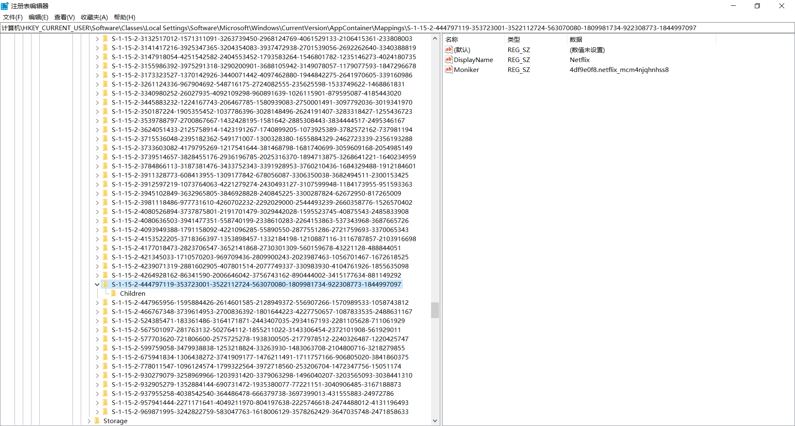
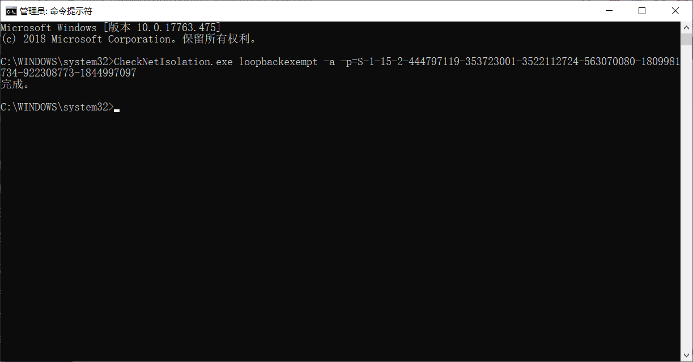
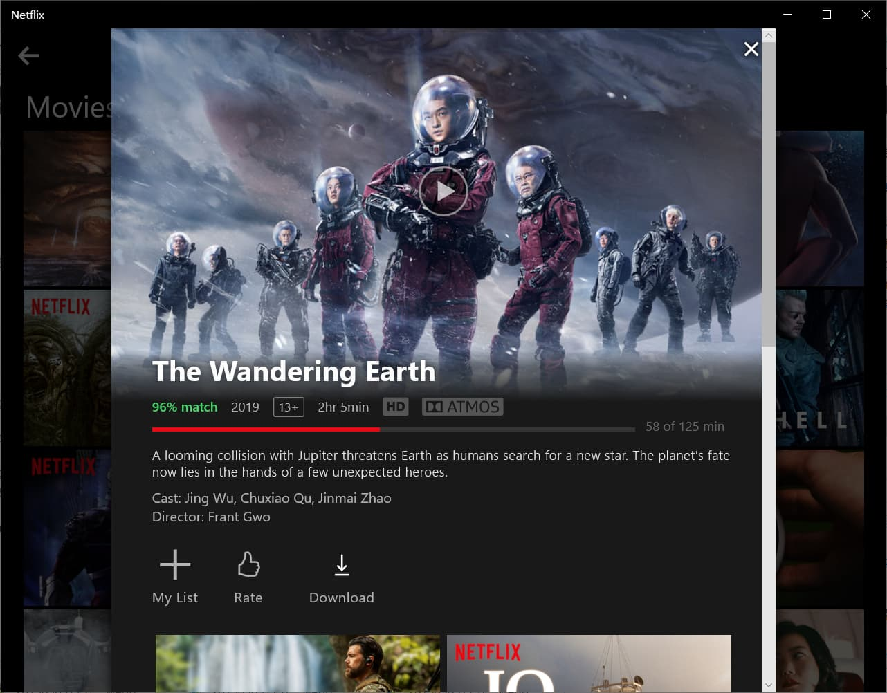

# Netflix UWP Windows客户端除网络隔离的方法

**此方式适用于其它内置应用**

之前一直用edge浏览器观看Netflix，今天突然无法播放，而且尝试了很多办法依然无解。

如果不介意清晰度关闭硬件加速的确能够正常播放，不过很明显这不符合我的需求，转变思路后决定使用Netflix UWP客服端，也就是从微软商店下载的。但是下载后无论你的代理软件是全局还是PAC都无法正常使用，原因在于Windows为了某种原因限制了这些软件访问127.0.0.1。

Windows 10（同时适用于8、8.1）自带一个CheckNetIsolation.exe程序，通过它可以将指定的程序添加到排除列表，让其内置应用可访问127.0.0.1。

**实现步骤：**

## 1.找到你要挂代理内置应用的SID

打开注册列表或者Win键+R打开运行窗口，运行Regedit打开注册表管理器，找到以下注册表项：

`HKEY_CURRENT_USER\Software\Classes\Local Settings\Software\Microsoft\Windows\CurrentVersion\AppContainer\Mappings`



在Mappings项下找到你要挂代理的应用，右边是DisplayName便是应用的名字，左边的便是应用的SID值。

右键【重命名】就可以复制应用`SID`了。

如图所示，比如Netflix的SID值是

`S-1-15-2-444797119-353723001-3522112724-563070080-1809981734-922308773-1844997097`

## 2.以管理员的身份打开CMD面板

输入以下命令：

```bash
CheckNetIsolation.exe loopbackexempt -a -p=SID
```

后面的`SID`即是找到的对应应用的`SID`值。

比如为`Netflix` `UWP`进行设置就是输入

```bash
CheckNetIsolation.exe loopbackexempt -a -p=S-1-15-2-444797119-353723001-3522112724-563070080-1809981734-922308773-1844997097
```

然后按`Enter`键回车，出现`「完成」`后就大功告成了。





::: tip 提示

附上CheckNetIsolation.exe的三种参数

CheckNetIsolation.exe loopbackexempt -s 显示当前列表

CheckNetIsolation.exe loopbackexempt -a -p=SID 添加指定程序到列表

CheckNetIsolation.exe loopbackexempt -d -p=SID 从列表中删除指定程序

:::