# AI - stable-diffusion(AI绘画)的搭建与使用

## 一、环境搭建

使用开源的 AI 绘画项目 `stable-diffusion` 绘制的，这是它的官方仓库：

- https://github.com/CompVis/stable-diffusion

但是这个官方项目并不适合我们这些新手直接使用，好在有一些基于 stable-diffusion 封装的 webui 开源项目，可以通过界面交互的方式来使用 stable-diffusion，极大的降低了使用门槛，以下是几个比较火的 webui 项目：

- https://github.com/AUTOMATIC1111/stable-diffusion-webui
  https://github.com/Sygil-Dev/sygil-webui

其中，AUTOMATIC1111 的 stable-diffusion-webui 是目前功能最多最好用的，强烈推荐，下面就来介绍如何使用它。


### 1、下载项目

stable-diffusion-webui 没有发布可执行程序（比如：.exe），我们需要通过 git 的方式将整个工程源码拉下来运行：

```bash
git clone https://github.com/AUTOMATIC1111/stable-diffusion-webui.git
```

注：这个开源项目目前的更新频率很快，会不定期的修复一些 bug 或加入一些新功能，所以建议可以时常 git pull 拉取最新代码。

### 2、Python 环境

stable-diffusion-webui 主要是使用 Python 开发的，所以运行这个工程，需要安装一下 Python 环境并配置好环境变量，因为 Python 环境的安装很简单，这里就不多说了，环境配置完成之后，可以通过以下命令查看 Python 的版本号，验证环境是否正常：

```bash
python --version
```

注意：官方推荐安装 Python 3.10.6 版本

另外，建议使用 Anaconda 管理多个 Python 环境，详见

- 官方的 conda 环境安装说明：https://github.com/AUTOMATIC1111/stable-diffusion-webui/wiki/Install-and-Run-on-NVidia-GPUs#alternative-installation-on-windows-using-conda

- anaconda 常用命令：https://blog.csdn.net/ligous/article/details/124209700
  

### 3、CUDA 环境

默认 stable-diffusion-webui 运行使用的是 GPU 算力，也就是说需要用到 Nvidia 显卡（配置越高，绘图越快）。这里我们需要安装 CUDA 驱动，先确定一下电脑能安装的 CUDA 版本，桌面右下角->右键 NVIDIA 设置图标->NVIDIA 控制面板：
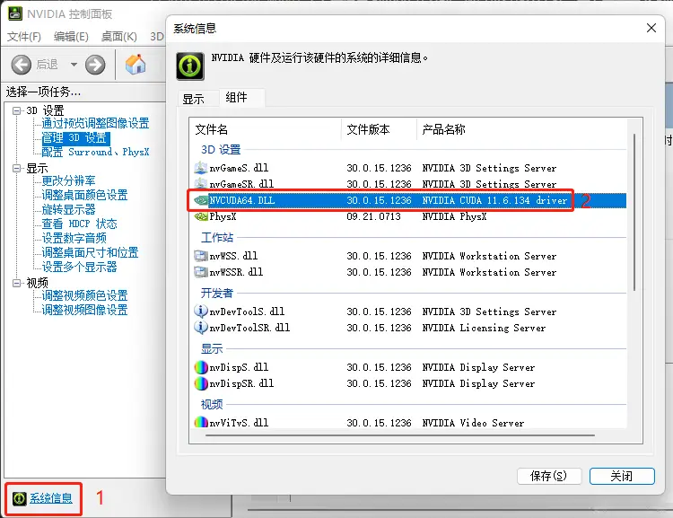

可以看到我的电脑的显示的是 `NVIDIA CUDA 11.6.134 driver`，所以我的电脑要安装的 CUDA 版本不能超过 11.6。

::: tip 注意

高版本显卡是可以安装低版本的 CUDA 驱动的，比如我也可以安装经典的 10.2 版本，但是安装 11.6 版本可以获得更高的 GPU 运行效率，所以一般来说推荐安装显卡支持的最高 CUDA 版本。

:::

在下面的网址中找到对应的 CUDA 版本进行安装：

- CUDA 官方归档：https://developer.nvidia.com/cuda-toolkit-archive

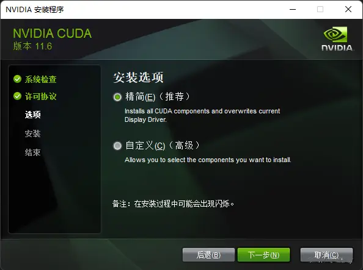

直接选择 “精简” 安装就可以了，安装完成之后，可以使用如下命令查看 CUDA 版本，来验证 CUDA 是否安装成功：

```bash
nvcc --version
```

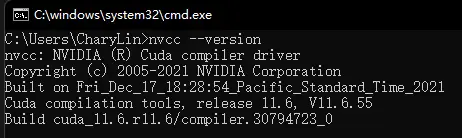

::: tip 注：

如果你没有 Nvidia 显卡，也可以通过给 stable-diffusion-webui 指定运行参数 --use-cpu sd，让其使用 CPU 算力运行，但是非常不建议你这么做，CPU 算力跟 GPU 算力相比简直天差地别，可能 GPU 只需要 10 秒就能绘制完成，而 CPU 却要 10 分钟，这不是开玩笑的。另外，如果你的显卡内存不多，建议 4G 的显卡加上 --medvram 启动参数，2G 的显卡加上 --lowvram 启动参数。怎么配置启动参数我们后面说。
:::

### 4、启动项目

在安装配置好运行环境之后，直接运行工程下的 webui-user.bat 文件即可（如果是类 Unix 系统，则运行 webui-user.sh）。首次启动会自动下载一些 Python 依赖库（具体哪些库请看工程下的 requirements.txt） ，以及项目需要用到的配置和模型文件（比如：v1-5-pruned-emaonly.safetensors，将近 4 个 G~），初始化一次之后，下次启动就快了。
```bash
Launching Web UI with arguments:
...
Running on local URL:  http://127.0.0.1:7860
To create a public link, set `share=True` in `launch()`.
```

看到这个提示就说明成功运行起来了，打开网址就可以看到程序的运行界面了：

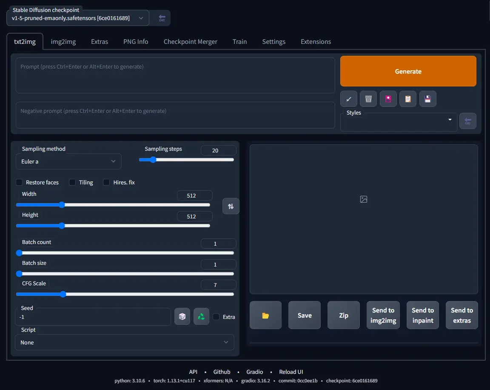

::: tip  温馨提示：

该项目是英文页面，可以使用浏览器的翻译功能转成中文来使用~

:::

## 二、使用

stable-diffusion-webui 的功能很多，主要有如下 2 个：

- 文生图（text2img）：根据提示词（Prompt）的描述生成相应的图片。

- 图生图（img2img）：将一张图片根据提示词（Prompt）描述的特点生成另一张新的图片。

  ::: tip 注：

  本文只讲解文生图（text2img）功能，图生图（img2img）后续有机会再出文章，喜欢的请多多点赞关注支持一下 😃。

  :::

### 1、文生图（text2img）

在开始使用文生图之前，有必要了解以下几个参数的含义：

| 参数            | 说明                                                         |
| ---- | ---- |
| Prompt          | 提示词（正向）                                               |
| Negative prompt | 消极的提示词（反向）                                         |
| Width & Height  | 要生成的图片尺寸。尺寸越大，越耗性能，耗时越久。             |
| CFG scale       | AI 对描述参数（Prompt）的倾向程度。值越小生成的图片越偏离你的描述，但越符合逻辑；值越大则生成的图片越符合你的描述，但可能不符合逻辑。 |
| Sampling method | 采样方法。有很多种，但只是采样算法上有差别，没有好坏之分，选用适合的即可。 |
| Sampling steps | 采样步长。太小的话采样的随机性会很高，太大的话采样的效率会很低，拒绝概率高(可以理解为没有采样到,采样的结果被舍弃了)。 |
| Seed            | 随机数种子。生成每张图片时的随机种子，这个种子是用来作为确定扩散初始状态的基础。不懂的话，用随机的即可。 |

::: tip 

以上对参数的解析源自以下文章：

- https://zhuanlan.zhihu.com/p/574063064

- https://baijiahao.baidu.com/s?id=1758865024644276830&wfr=spider&for=pc

  :::

接下来我们来生成一张赛博朋克风格的猫咪图片，配置以下参数后，点击 “Generate” 即可：

```bash
Prompt：a cute cat, cyberpunk art, by Adam Marczyński, cyber steampunk 8 k 3 d, kerem beyit, very cute robot zen, beeple |

Negative prompt：(deformed, distorted, disfigured:1.3), poorly drawn, bad anatomy, wrong anatomy, extra limb, missing limb, floating limbs, (mutated hands and fingers:1.4), disconnected limbs, mutation, mutated, ugly, disgusting, blurry, amputation, flowers, human, man, woman

CFG scale：6.5

Sampling method：Euler a

Sampling steps：26

Seed：1791574510
```

::: tip 注：

提示词（Prompt）越多，AI 绘图结果会更加精准，另外，目前中文提示词的效果不好，还得使用英文提示词。

:::

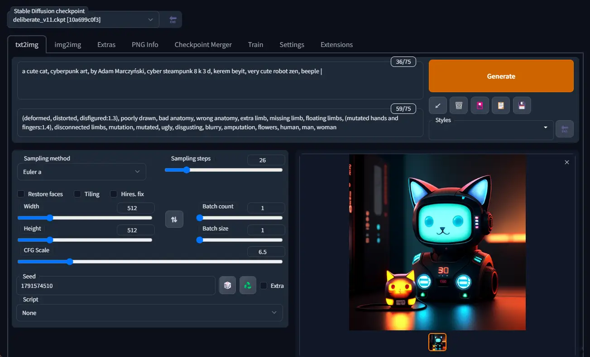

### 2、模型文件

眼尖的你可能发现了，上面截图里左上角 Stable Diffusion checkpoint 的值怎么跟之前截图里的不一样？这是因为我换了一个模型文件，还记得前面提到那个将近 4 个 G 大小的模型文件（v1-5-pruned-emaonly.safetensors）吗？那是 stable-diffusion-webui 的默认模型文件，用这个模型文件生成出来的图片比较丑，因此我换了另一个模型文件。模型文件下载的网站几个，比较出名的就是 civitai，这上面共享的都是别人训练好的模型。
::: tip  模型文件下载地址：

- `civitai`：https://civitai.com/

- 默认的 `v1-5-pruned-emaonly`：https://huggingface.co/runwayml/stable-diffusion-v1-5/tree/main

  :::


根据你要生成的图片风格（比如：动漫、风景），挑选合适的模型查看，前面那个文生图的例子，使用的就是这个 `Deliberate` 模型，直接点击 “Download Latest” 即可下载该模型文件。

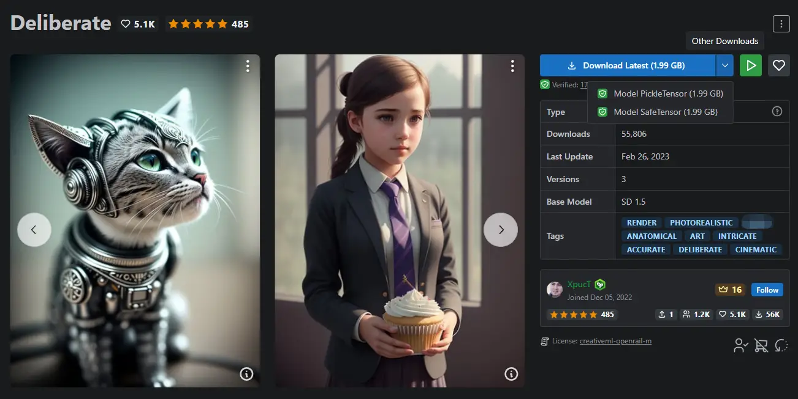

::: tip 注:

模型文件有 2 种格式，分别是 `.ckpt`（Model PickleTensor） 和 `.safetensors`（Model SafeTensor），据说 `.safetensors` 更安全，这两种格式 `stable-diffusion-webui` 都支持，随意下载一种即可。

:::

将下载好的模型文件放到 `stable-diffusion-webui\models\Stable-diffusion` 目录下：

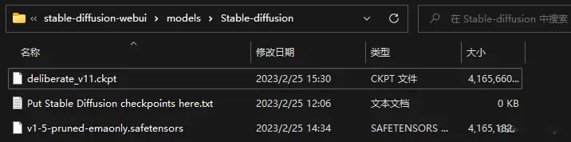

放置好模型文件之后，需要重启一下 `stable-diffusion-webui`（执行 `webui-user.bat`）才能识别到。

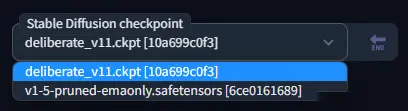

这些模型文件一般会附带一组效果图，点击任意一张，就可以看到生成该效果图的一些参数配置：

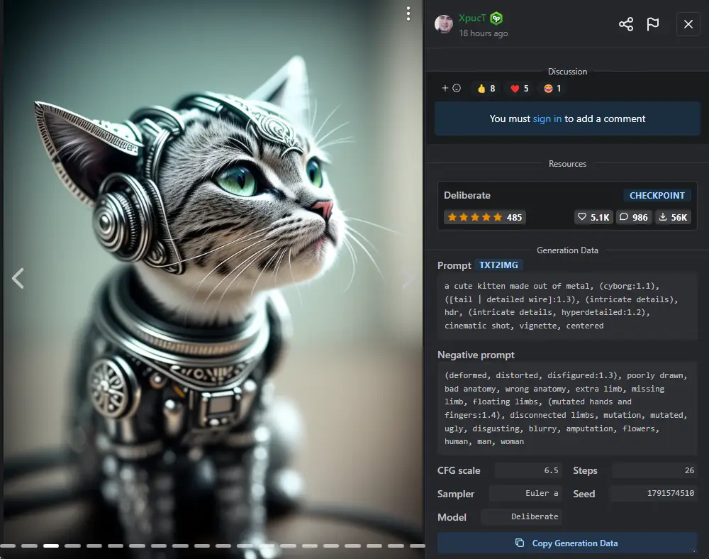

把这些参数配置到 `stable-diffusion-webui` 中，点击 “Generate” 就可以生成类似效果的图片了。

::: tip 注：

把这些参数配置到 `stable-diffusion-webui` 中，点击 “Generate” 就可以生成类似效果的图片了。

:::

文生图功能有很多东西可以发掘，你可以用它来生成世界上独一无二的图片，而要用好文生图功能，提示词（Prompt）是必须掌握的重中之重，它是有语法规则的，在此推荐两篇对 Prompt 详细说明的文章：

- 全网 Stable Diffusion Prompt 运用技巧：https://www.bilibili.com/read/cv19903784
- Prompt 工具網站：https://www.accucrazy.com/prompt-tools-ai/

## 三、工程配置

前面说到，stable-diffusion-webui 是可以配置启动参数的，这是官方的 wiki：

- 配置参数文档：https://github.com/AUTOMATIC1111/stable-diffusion-webui/wiki/Command-Line-Arguments-and-Settings
  

### 1、常用参数

这里列几个常用的参数说明一下：

| 参数                           | 说明                                                         |
| :----------------------------- | ------------------------------------------------------------ |
| –listen                        | 默认启动绑定的 ip 是 `127.0.0.1`，只能是你自己电脑可以访问 webui，如果你想让同个局域网的人都可以访问的话，可以配置该参数（会自动绑定 `0.0.0.0` ip）。 |
| –port xxx                      | 默认端口是 `7860`，如果想换个端口，可以配置该参数，例如：`--port 8888`。 |
| –gradio-auth username:password | 如果你希望给 webui 设置登录密码，可以配置该参数，例如：`--gradio-auth GitLqr:123456`。 |
| –use-cpu                       | 默认使用 GPU 算力（需要 Nvidia 显卡），如果没显卡，可以配置该参数，改用 CPU 算力。 |
| –medvram                       | 为低显存（比如：4G）启用模型优化，会牺牲一点速度。           |
| –lowvram                       | 为极低显存（比如：2G）启用模型优化，会牺牲很多速度。         |
| –autolaunch                    | 启动时自动打开浏览器访问 webui。                             |

```bash
@echo off

set PYTHON=
set GIT=
set VENV_DIR=
set COMMANDLINE_ARGS=--listen --port 8888 --gradio-auth GitLqr:123456 --autolaunch

call webui.bat
```

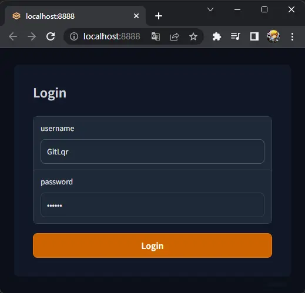

### 2、API 接口服务

除了上述几个常用的参数外，还有一个特别的参数 `--api`，可以在启动 `stable-diffusion-webui` 的同时，启动一个接口服务，在 `COMMANDLINE_ARGS` 后面追加上 `--api`：

```bash
@echo off

set PYTHON=
set GIT=
set VENV_DIR=
set COMMANDLINE_ARGS=--listen --port 8888 --gradio-auth GitLqr:123456 --autolaunch --api

call webui.bat
```

重启后在 url 后面加上 `/docs` 即可看到 api 请求说明文档：

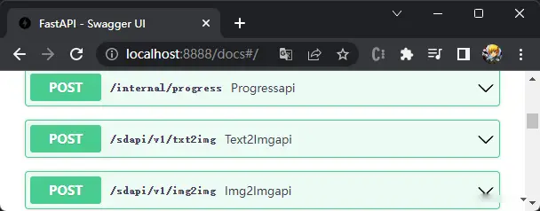

这样我们就可以通过编写程序的方式，使用文生图、图生图等功能了，关于接口传参格式等要求，参见官方 wiki：

- 官方 api 说明文档：https://github.com/AUTOMATIC1111/stable-diffusion-webui/wiki/API#api-guide-by-kilvoctu
