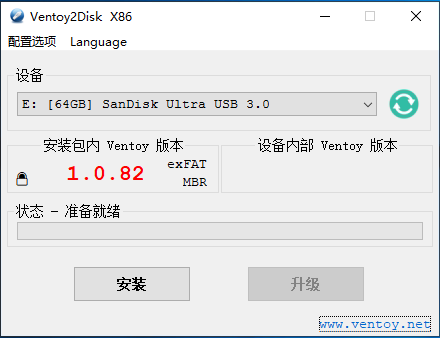
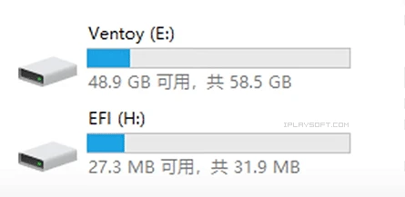
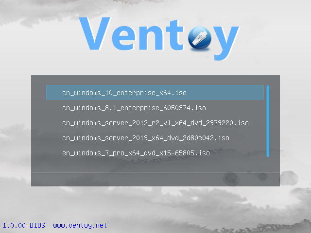

# Ventoy 安装教程

 **Ventoy 多合一启动盘制作工具神器 - 将多个系统 Win/PE/Linux 镜像装在1个U盘里**

最近很多操作系统都纷纷发布了新版本，比如 [Windows 11](https://www.microsoft.com/zh-cn/windows)、[Ubuntu](https://www.ubuntu.org.cn/)、[Debian](https://www.debian.org/)、[Archlinux](https://archlinux.org/)、[FydeOS](https://fydeos.com/) 等等，对喜欢玩系统的人来说绝对是盛宴。

不过一般用 [Rufus](https://rufus.ie/) 等工具，一个**U盘**往往只能制作成一个系统的启动盘/安装盘，想要增加另一款系统，只能得重新刻录一遍，每次都要格式化超花时间。而最近发现了一款“**多合一启动盘**”的制作工具 **Ventoy**，简单到拷贝个 ISO 文件进去就能用，堪称新一代的=装机必备神器。

## 介绍：

**Ventoy** 是一款开源免费的多合一系统安装盘/启动盘制作工具，支持 **Windows** 家族与 **Linux**几乎所有主流发行版。它最大的好处在于，你可以在 1 个 U 盘里集成 N 多款不同类型的操作系统安装盘 (比如 Windows、WinPE、Linux)，可引导启动，并通过菜单来选择安装。

使用 **Ventoy** 制作多合一启动盘的方式简单到爆！基本上，你只需从网上去下载操作系统的 **ISO** 镜像文件，把它拷贝到 **Ventoy** 的 U 盘里面的任意非中文目录下即可，每次增加/移除系统均不需要重新格式化。

**Ventoy** 会自动扫描 U 盘里的 .iso 文件，并自动识别出它是什么系统，然后帮你建立对应的启动引导菜单！所以，需要给启动盘增加或移除一个操作系统，只是将 .iso 文件复制进去或者删除掉即可，就是这么简单，没有任何复杂或耗时的步骤。

**Ventoy** 支持的系统非常丰富，其中包括主流的 Windows 11 / Win10 / 8.1 / 8 / 7、WinPE (微 PE 工具箱)、 Windows Server 2022/2019/2016/2012、Ubuntu、CentOS、Debian、RHEL、Deepin、Fedora、Linux Mint、 Elementary OS、Manjaro、VMware ESXi、openSUSE、Arch、FydeOS、 CloudReady、 ChromeOS Flex 等超过 216 款！而且还在不断增加中，具体可参考[官网列表]([test list . Ventoy](https://www.ventoy.net/cn/isolist.html))。

## 制作启动盘教程:

Ventoy 提供了 Windows 和 Linux 两大平台版本的制作工具，这里以 Windows 为例子。先下载 [Ventoy]([Download . Ventoy](https://www.ventoy.net/cn/download.html)) 的安装包解压，获得 `Ventoy2Disk.exe` 文件。双击启动它，就能打开 Ventoy 的制作器界面了， 如图所示。

插入你的 U 盘并选择正确的盘符，然后点击 Install 按钮即可将 Ventoy 安装进去。其中，“设备内部 Ventoy 版本”如果为空则表示 U 盘未安装过 Ventoy，如安装过，可点击 Update 升级 U 盘里的 Ventoy 程序。升级 Ventoy 版本并不会影响到已有的 ISO 文件。

Ventoy 安装完成之后，U盘会被分成两个区。第一个分区将会被默认格式化为 exFAT (当然你也可以将其格式化为NTFS)格式的文件系统，你可以在这里存放日常使用的普通文档，当普通 U 盘使用。当你需要制作启动盘时，你只需要把系统镜像文件 .iso 拷贝到这个分区里面即可。

你可以随意把 ISO 文件放在根目录或任意子目录下。 Ventoy 会自动扫描找出 U 盘里所有的 ISO 文件，并按照字母排序之后显示在菜单中。**但必须注意的是，.iso 文件的路径中 (包括目录、子目录和文件名) 均不能包含中文或者空格！**

拷贝完你的 iso 镜像之后，直接拿去给电脑做启动引导即可。可以说，这个制作过程完全零难度。

U 盘插到电脑上按 `DEL` / `F1` / `F8` 进入主板选项 U 盘启动 (不同机器按键不相同)，即可顺利显示出菜单了！在菜单中选择某一个系统后，就能进入它原本的安装流程了。你也可以使用 Parallels Desktop 或者 VMWare 虚拟机验证一下你的启动盘所有的系统是否都能正常进入安装流程。

## 总结：

**Ventoy** 最好的一点在于，制作好启动 U 盘之后，依然能当普通 U 盘使用。而且它能随意添加/移除操作系统，不必每次都格式化！你只需拷贝或删除 .iso 镜像文件就行，速度很快。

有了 Ventoy，你不需每次出新版本的系统镜像时，就去刻录重写一次 U 盘了；而且你的大容量 U 盘也有了更多用武之地！将 WinPE、Win11 / 10、Ubuntu 等一系列热门系统全集成在一起，日后装机就方便太多了！