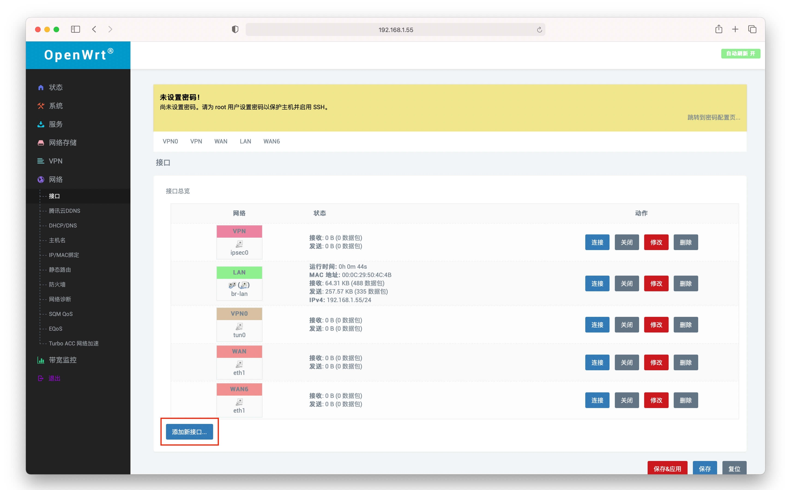
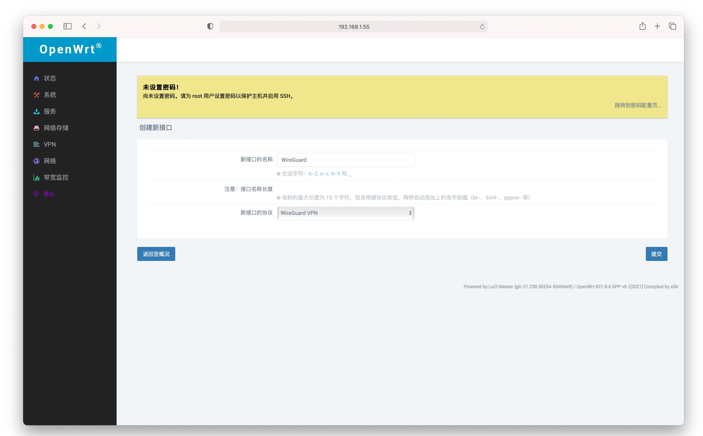
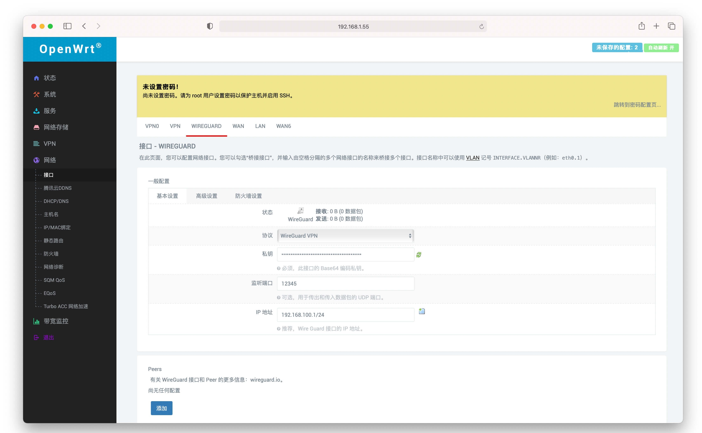
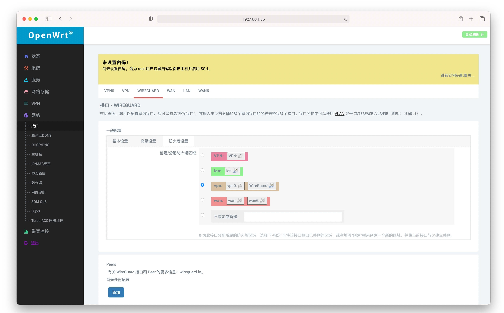
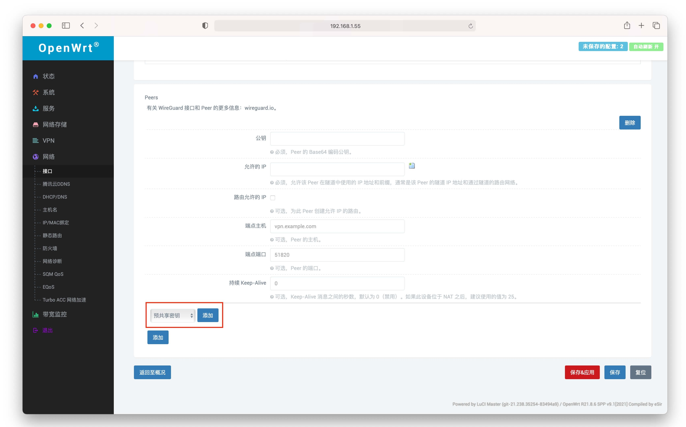
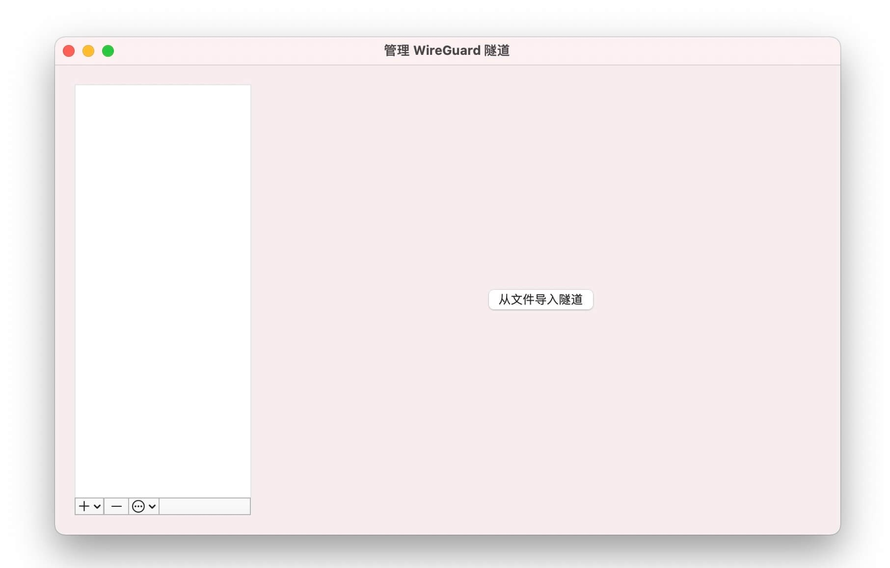
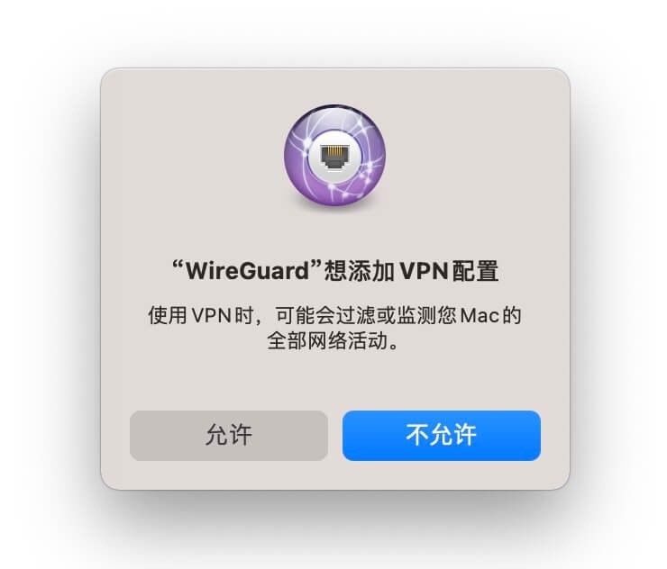
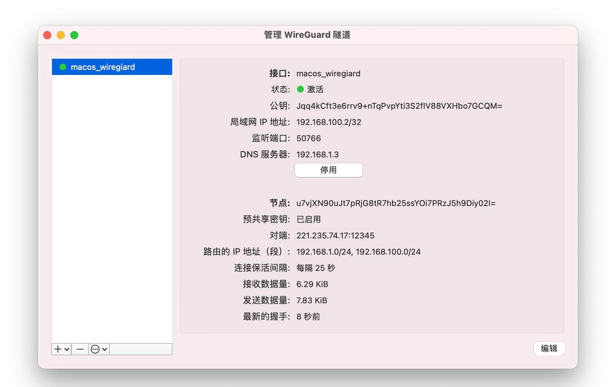
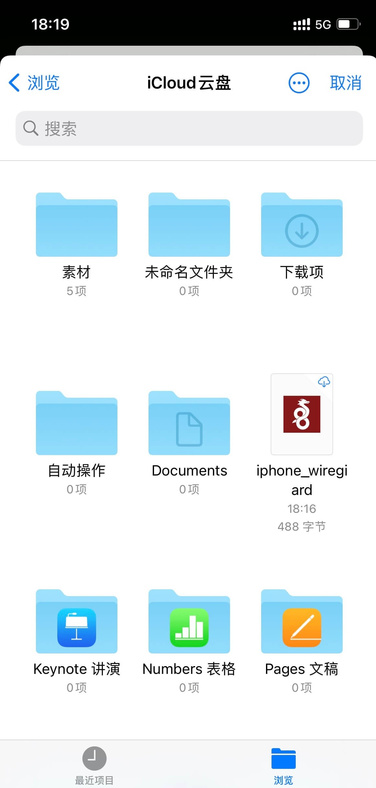
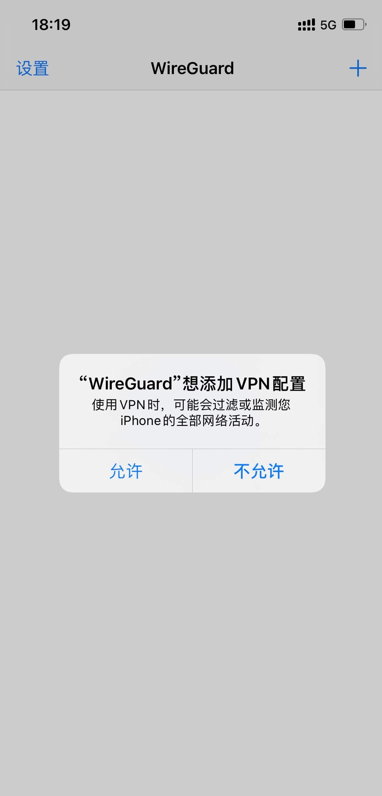

# OpenWRT 配置 WireGuard 服务端及客户端配置教程

## 前言

去年还是前年因为需要访问家里设备在 **OpenWRT**上部署了 **OpenVPN**,主要用于在外方便`VPN 回家`的使用场景。使用了很长一段时间，在 Windows、macOS、iOS、安卓上体验都非常的稳定。

而今天的主角是已经火了几年的了`WireGuard`, 同样是 **VPN 回家服务**,试用了一段时间后决定以后主用 WG 了。(~~主要是用的固件没有集成OpenVPN，每次升级都要自己重新安装一次太麻烦了~~)。

由于 **WireGuard** 在 **Linux** 上安装配置较为麻烦,而很多 **OpenWRT** 固件也都预装了 **WG** ,并且有图形化界面方便设置.所以目前推荐还是在 **OpenWRT** 来直接使用。

## 1、服务端

::: warning 注意

我的 OpenWRT 是以**旁路由**的形式存在于家庭网络中,**所以后续防火墙设置可能和把 OpenWRT 当主路由的形式不同.**

:::

### 1.1 创建密钥 

---

#### 1.1.1 预共享密钥

通过`SSH`登陆到 OpenWRT 后台。

```bash
mkdir wg
# 创建目录存放公钥私钥
cd wg
# 进入文件夹
umask 077
# 配置创建密钥的权限
wg genpsk > sharekey
# 创建预共享密钥
cat sharekey
# 获取密钥复制保存
```


#### 1.1.2 服务端公钥私钥

```bash
wg genkey | tee server_privatekey | wg pubkey > server_publickey
# 创建服务端公钥和私钥
cat server_privatekey
# 获取服务端私钥复制保存
cat server_publickey
# 获取服务端公钥复制保存
```


#### 1.1.3 客户端公钥私钥 ( macOS )

`重复此操作创建每个客户端的公钥和私钥,请注意修改以下命令中的文件名,本文以 macOS 为例:`

```bash
wg genkey | tee macos_privatekey | wg pubkey > macos_publickey
# 创建 macOS 客户端公钥和私钥
cat macos_privatekey
# 获取 macOS 客户端私钥复制保存
cat macos_publickey
# 获取 macOS 客户端公钥复制保存
```


### 1.2 配置 OpenWRT

---

#### 1.2.1 服务端相关配置

登陆 OpenWRT – 网络 – 接口 – 添加新接口



填写接口名 – 选择接口协议 – 提交



基本设置 – 填写上文获取的`服务端私钥`
自行填写一个端口号 – `并且在路由器映射该端口的 UDP 协议`
IP 地址填写一个 VPN 专用的网段 IP – 本文以`192.168.100.X`为 WireGuard 的专用网段为例,则本 WG 服务器 IP 为`192.168.100.1/24`



防火墙设置 – 选择 vpn



#### 1.2.2 客户端 Peers 区域为每个客户端添加配置

选择`预共享密钥` – 添加



公钥 – 填写上文获取的`macOS 客户端公钥`
预共享密钥 – 填写上文获取的`预共享密钥`
允许的 IP – 即表示为此 macOS 客户端分配固定 IP , 本文示例为 `192.168.100.2/32` , **注意各客户端 IP 不能冲突**.
持续 Keep-Alive – 填写 25


#### 1.2.3 防火墙

网络 – 防火墙 – 自定义防火墙 – 添加以下防火墙 – 重启防火墙

```bash
iptables -t nat -A POSTROUTING -s 192.168.100.0/24 -o br-lan -j MASQUERADE
# 注意此条防火墙网段 192.168.100.0/24 需和上文服务端 IP 网段保持一致。
```

**再次声明我的 OpenWRT 是作为旁路由接入**,此条防火墙不确定适用于主路由部署 WireGuard 使用.主路由用户可以尝试无需设置防火墙(经朋友测试)

#### 1.2.4 重启 WireGuard

返回网络 – 接口 – 关闭 – 连接
或者直接重启整个 OpenWRT 最为稳妥


## 2、客户端

### 2.1 创建客户端配置文件

创建后缀为`.conf`的配置文件,例如`macos_wireguard.conf`,复制以下信息,并且修改对应的公私钥信息:

```bash
[Interface]
Address = 192.168.100.2/32
# 对应 macOS 客户段分配的 IP
PrivateKey = qJHywBpl27Ao/TRse85DQ/f+kwfNGRmPDYCq0OC6uUY=
DNS = 192.168.1.3
# 本地的 DNS 服务器或者公有 DNS 服务器,例如: 114.114.114.114
[Peer]
PublicKey = u7vjXN90uJt7pRjG8tR7hb25ssYOi7PRzJ5h9Diy02I=
AllowedIPs = 192.168.1.0/24, 192.168.100.0/24
# macOS 如上设置可与 ClashX Pro 共存仅代理局域网,互联网走本地网络.
# iPhone iPad 设置为 0.0.0.0/0 全局则模式.
PresharedKey = Pu5xBEBmz9ghhUMNp5o72s+w7nuLwxJJUgNk3EljFVo=
# 预共享密钥
Endpoint = ddns.xxxxx.com:12345
PersistentKeepalive = 25
```

此时的配置文件是用于客户端的,所以`PrivateKey`则为 macOS 客户端的私钥,而`Peer`中的`PublicKey`则为 OpenWRT 的公钥.**请注意反向思考**,`Endpoint`填写家中的 IP 或者 DDNS 域名和端口。

#### 2.1.1 AllowedIPs

值得注意的是`AllowedIPs`参数。针对不同场景和需求,此处可以配置不用的路由。
当此处为`0.0.0.0/0`时表示任意网络请求都经过 VPN 俗称全局 VPN , 由于 iPhone 同时只能有 1 个 VPN 软件在线,所以当 `WireGuard` 启动时,其他类似`Quanx`,`小火箭`等软件则无法使用,此时 iPhone 可以全局 VPN 使用家中的网络来访问一些外网。

如果是 macOS 或 Windows 客户端,`WireGuard`和`Clash`等软件可以共存,此处可以设置为`AllowedIPs = 192.168.1.0/24, 192.168.100.0/24`,表示访问内网网段才会走 VPN 。而其他互联网,外网等访问还是走当前网络来利用`Clash`分流。

### 2.2 macOS

在 macOS App Store 下载 `WireGuard`,从文件导入隧道。



选择允许添加 VPN 配置



连接成功



在 OpenWRT 状态页面能够看到连接成功的状态信息


### 2.3 iOS

重复上述操作创建 iPhone 的配置文件,并上传至 iCloud 云盘.
在 iOS 设备 App Store 下载 `WireGuard`


添加隧道 – 导入配置或压缩包


从 iCloud 云盘中选择 iphone_wireguard.conf 配置文件



选择允许添加 VPN 配置



连接成功


## 结语

本文详细的讲解了在 OpenWRT 上如何配置 WireGuard 以及客户端的安装和配置。
