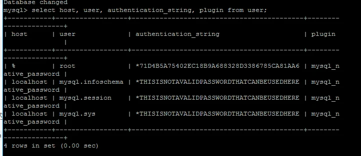

# Centos7重置Mysql8 root 密码
安装完 最新版的 mysql8后忘记了密码，想重置root密码；找了网上好多资料都不尽相同，根据自己的问题总结如下：
## 一、修改配置文件免密码登录mysql
### 1.1 打开配置文件
`vim /etc/my.cnf`


### 1.2 在 [mysqld]最后加上如下语句 并保持退出文件
`skip-grant-tables`


### 1.3 重启mysql服务
`service mysqld restart`
## 二、免密登录mysql，直接在命令行上输入
```
mysql
//或者
mysql -u root -p 
//password直接回车
```
## 三、给root用户重置密码
### 3.1首先查看当前root用户相关信息，在mysql数据库的user表中
``` sql
select host, user, authentication_string, plugin from user;
```

host: 允许用户登录的ip‘位置’%表示可以远程；

user:当前数据库的用户名；

authentication_string: 用户密码；在mysql 5.7.9以后废弃了password字段和password()函数；

plugin： 密码加密方式；



### 3.2如果当前root用户authentication_string字段下有内容，先将其设置为空
``` sql
use mysql;
update user set authentication_string='' where user='root';
```
### 3.3 退出mysql, 删除/etc/my.cnf文件最后的 skip-grant-tables 重启mysql服务
### 3.4 使用root用户进行登录，因为上面设置了authentication_string为空，所以可以免密码登录
```
mysql -u root -p
passwrod:直接回车;
```
### 3.5使用ALTER修改root用户密码
``` sql
 ALTER user 'root'@'localhost' IDENTIFIED BY 'Qian123#'
```
至此修改成功； 重新使用用户名密码登录即可。

::: tip 提示
一定不要采取如下形式改密码：
``` sql
use mysql;
update user set authentication_string="newpassword" where user="root";
```
这样会给user表中root用户的authentication_string字段下设置了newpassword值；

当再使用ALTER USER 'root'@'localhost' IDENTIFITED BY 'newpassword'时会报错的；

因为authentication_string字段下只能是mysql加密后的41位字符串密码；其它的会报格式错误；
:::